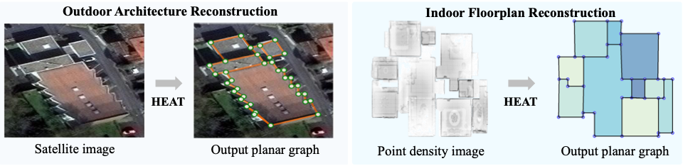
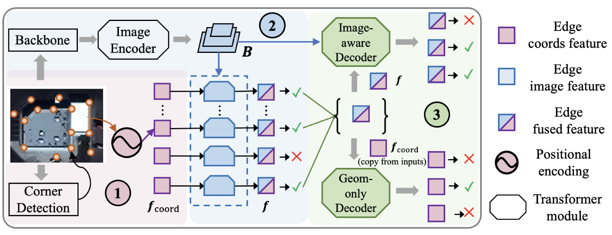

# HEAT: Holistic Edge Attention Transformer for Structured Reconstruction 

 [](https://www.gnu.org/licenses/gpl-3.0) 

Official implementation of the paper [HEAT: Holistic Edge Attention Transformer for Structured Reconstruction](https://arxiv.org/abs/2111.15143) (**CVPR 2022**).

[[Project page]](https://heat-structured-reconstruction.github.io/), [[Arxiv]](https://arxiv.org/abs/2111.15143)

Please use the following bib entry to cite the paper if you are using resources from this repo.

```
@inproceedings{chen2022heat,
     title={HEAT: Holistic Edge Attention Transformer for Structured Reconstruction},
     author={Chen, Jiacheng and Qian, Yiming and Furukawa, Yasutaka},
     booktitle={IEEE Conference on Computer Vision and Pattern Recognition (CVPR)},
     year={2022}
} 
```

## Introduction



This paper focuses on a typical family of structured reconstruction tasks: planar graph reconstruction. Two different tasks are included: 1) outdoor architecture reconstruction from a satellite image; or 2) floorplan reconstruction from a point density image. The above below shows examples. The key contributions of the paper are:

- a transformer-based architecture w/ state-of-the-art performance and efficiency on two different tasks, w/o domain specific heuristics
- a geometry-only decoder branch w/ a masked training strategy to enhance the geometry learning




As shown by the above figure, the overall pipeline of our method consists of three key steps: 1) edge node initialization; 2) edge image feature fusion and edge filtering; and 3) holistic structural reasoning with two weight-sharing transformer decoders. Please refer to the paper for more details.


This repo provides the code, data, and pre-trained checkpoints of HEAT for the two tasks covered in the paper.


## Preparation

**Note: The code, data, and pre-trained models in this repo are for non-commercial research purposes only, please check the LICENSE file for details.**

### Environment

This repo was developed and tested with ```Python3.7```

Install the required packages, and compile the deformable-attention modules (from [deformable-DETR](https://github.com/fundamentalvision/Deformable-DETR))

```
pip install -r requirements.txt
cd  models/ops/
sh make.sh
cd ...
```

### Data

Please download the data for the two tasks from the [link](https://drive.google.com/file/d/1BL58xl2U8H96YBkkB7WjDmtznuEj6PbG/view?usp=sharing) here.  Extract the data into the ```./data``` directory.

The file structure should be like the following:
```
data
├── outdoor
│   ├── cities_dataset  # the outdoor architecture dataset from previous works
│   │      ├── annot    # the G.T. planar graphs
│   │      ├── rgb      # the input images
│   │      ├── ......   # dataset splits, miscs
│   │
│   └── det_finals   # corner detection results from previous works (not used by our full method, but used for ablation studies) 
│
└── s3d_floorplan       # the Structured3D floorplan dataset, produced with the scripts from MonteFloor
    ├── annot           # the G.T. planar graphs 
    │
    ├── density         # the point density images
    │
    │── ......          # dataset splits, miscs
```
Note that the Structured3D floorplan data is generated with the scripts provided by MonteFloor[1]. We thank the authors for kindly sharing the processing scripts, please cite their paper if you use the corresponding resources. 

#### Data preprocessing for floorplan reconstruction (Optional)

All the data used in our paper are provided in the download links above. However, If you are interested in the data preparation process for the floorplan reconstruction task, please refer to the [```s3d_preprocess```](https://github.com/woodfrog/heat/tree/master/s3d_preprocess) directory in which we provide the scripts and a brief doc. 

### Checkpoints

We provide the checkpoints for our full method under [this link](https://drive.google.com/file/d/1Oua4RCaxOIm7-mWXoUJZHTNE3oSPrDTw/view?usp=sharing), please download and extract.


## Inference, evaluation, and visualization

We provide the instructions to run the inference, quantitative evaluation, and qualitative visualization in this section.

### Outdoor architecture reconstruction

- **Inference.** Run the inference with the pre-trained checkpoints, with image size 256:

    ```
    python infer.py --checkpoint_path ./checkpoints/ckpts_heat_outdoor_256/checkpoint.pth  --dataset outdoor --image_size 256 --viz_base ./results/viz_heat_outdoor_256 --save_base ./results/npy_heat_outdoor_256
    ```

    or with image size 512:

    ```
    python infer.py --checkpoint_path ./checkpoints/ckpts_heat_outdoor_512/checkpoint.pth  --dataset outdoor --image_size 512 --viz_base ./results/viz_heat_outdoor_512 --save_base ./results/npy_heat_outdoor_512
    ```

- **Quantitative evaluation.** The quantitative evaluation for this dataset is included in the inference script. The metric implementations (in ```./metrics```) are borrowed from [Explore-classify[2]](https://zhangfuyang.github.io/expcls/).  

- **Qualitative evaluation.** To get the qualitative visualizations used in our paper, set the paths properly in ```./qualitative_outdoor/visualize_npy.py```, and then run:

    ```
    cd qualitative_outdoor
    python visualize_npy.py
    cd ..
    ```

### Floorplan reconstruction

- **Inference.** Run the inference with the pre-trained checkpoints:

    ```
    python infer.py --checkpoint_path ./checkpoints/ckpts_heat_s3d_256/checkpoint.pth  --dataset s3d_floorplan --image_size 256 --viz_base ./results/viz_heat_s3d_256 --save_base ./results/npy_heat_s3d_256 
    ```

- **Quantitative evaluation.** The quantitative evaluation is again adapted from the code of MonteFloor[1], we thank the authors for sharing the evaluation code. Please first download the data used by MonteFloor with [this link](https://drive.google.com/file/d/1XpKm3vjvw4lOw32pX81w0U0YL_PBuzez/view?usp=sharing) (required by evaluation code) and extract it as ```./s3d_floorplan_eval/montefloor_data```. Then run the evaluation by:
    ```
    cd s3_floorplan_eval
    python evaluate_solution.py --dataset_path ./montefloor_data --dataset_type s3d --scene_id val
    cd ..
    ```
  Note that we augment the original evaluation code with an algorithm for extracting valid planar graph from our outputs (implemented in ```/s3d_floorplan_eval/planar_graph_utils.py```). Invalid structures including crossing edges or unclosed loops are discarded. The same algorithm is also applied to all our baseline approaches.

- **Qualitative evaluation.** To generate the qualitative visualization results used in the paper, set the paths properly in ```./s3d_floorplan_eval/visualize_npy.py```, and then run:
  ```
  cd s3d_floorplan_eval
  python visualize_npy.py
  cd ..
  ```
  Note that the incomplete regions are discarded before the quantitative evaluation. The quantitative metrics from MonteFloor[1] are room-based, and incomplete regions are simply treated as missing rooms. For qualitative visualization, we plot all predicted corners and edges, but only complete (i.e., valid) regions are colored. 


## Training

Set up the training arguments in ```arguments.py```, and then run the training by:

```
CUDA_VISIBLE_DEVICES={gpu_ids} python train.py
```

Or specify the key arguments in the command line and run the outdoor experiment by:

```
CUDA_VISIBLE_DEVICES={gpu_ids} python train.py  --exp_dataset outdoor  --epochs 800 --lr_drop 600  --batch_size 16  --output_dir ./checkpoints/ckpts_heat_outdoor_256  --image_size 256  --max_corner_num 150  --lambda_corner 0.05  --run_validation
```

or run the s3d floorplan experiment by:

```
CUDA_VISIBLE_DEVICES={gpu_ids} python train.py  --exp_dataset s3d_floorplan  --epochs 400 --lr_drop 300  --batch_size 16  --output_dir ./checkpoints/ckpts_heat_s3d_256  --image_size 256  --max_corner_num 200  --lambda_corner 0.10  --run_validation
```

With the default setting (e.g., model setup, batch size, etc.), training the full HEAT (i.e., the end-to-end corner and edge modules) needs at least 2 GPUs with ~16GB memory each. 


## References

[1]. Stekovic, Sinisa, Mahdi Rad, Friedrich Fraundorfer and Vincent Lepetit. “MonteFloor: Extending MCTS for Reconstructing Accurate Large-Scale Floor Plans.” 2021 IEEE/CVF International Conference on Computer Vision (ICCV) (2021): 16014-16023.

[2]. Zhang, Fuyang, Xiangyu Xu, Nelson Nauata and Yasutaka Furukawa. “Structured Outdoor Architecture Reconstruction by Exploration and Classification.” 2021 IEEE/CVF International Conference on Computer Vision (ICCV) (2021): 12407-12415. 
